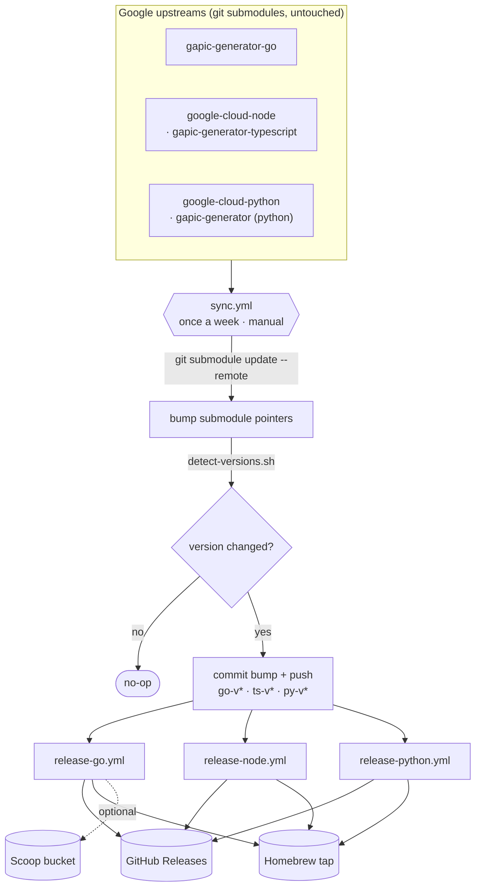
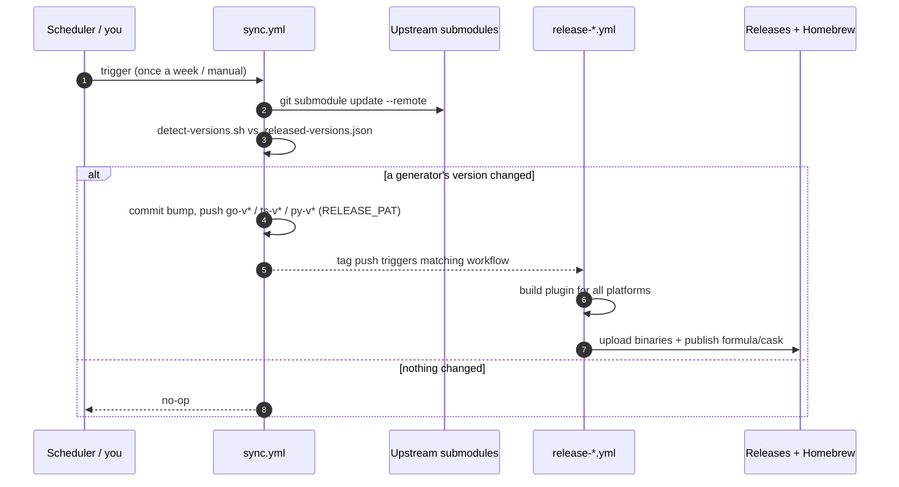

<div align="center">

# GAPIC plugin distribution

**Prebuilt, cross-platform binaries of Google's three GAPIC `protoc` code-generator plugins — aggregated, versioned to upstream, and auto-released under one roof.**

[](https://github.com/the-protobuf-project/gapic/actions/workflows/sync.yml)
[](#license)

[](https://github.com/the-protobuf-project/gapic/releases?q=go-v)
[](https://github.com/the-protobuf-project/gapic/releases?q=ts-v)
[](https://github.com/the-protobuf-project/gapic/releases?q=py-v)

</div>

## Table of contents

- [Support](#support)
- [Latest release](#latest-release)
  - [Install](#install)
  - [Platform support](#platform-support)
- [Architecture](#architecture)
  - [Pipeline](#pipeline)
  - [Release sequence](#release-sequence)
- [Why this repo exists](#why-this-repo-exists)
- [One-time setup](#one-time-setup)
- [Manual sync](#manual-sync)
- [Copyright](#copyright)
- [License](#license)

## Support

| Need | Where |
|---|---|
| A build/release/automation bug **in this repo** | [Open an issue](https://github.com/the-protobuf-project/gapic/issues) |
| Questions about installing/using the published plugins | [Discussions](https://github.com/the-protobuf-project/gapic/discussions) |
| Bugs in the **generated output** or the generators themselves | Upstream: [gapic-generator-go](https://github.com/googleapis/gapic-generator-go) · [gapic-generator-typescript](https://github.com/googleapis/google-cloud-node/tree/main/core/generator/gapic-generator-typescript) · [gapic-generator-python](https://github.com/googleapis/google-cloud-python/tree/main/packages/gapic-generator) |

This project **only repackages and redistributes** upstream code — it does not modify the generators. Issues with what a generator *produces* belong upstream; issues with how it's *built or shipped* belong here.

## Latest release

Each plugin tracks its **own upstream version** on an independent tag stream (`go-v*`, `ts-v*`, `py-v*`). The badges at the top always show the current released version; browse all artifacts on the [Releases page](https://github.com/the-protobuf-project/gapic/releases).

| Plugin | Built from | Tag stream | Binary |
|---|---|---|---|
| **Go** | `gapic-go` → `cmd/protoc-gen-go_gapic` | `go-v*` | `protoc-gen-go_gapic` |
| **Node/TS** | `gapic-node` → `core/generator/gapic-generator-typescript` | `ts-v*` | `protoc-gen-typescript_gapic` |
| **Python** | `gapic-python` → `packages/gapic-generator` | `py-v*` | `protoc-gen-python_gapic` |

### Install

Homebrew (macOS + Linux, amd64/arm64):

```bash
brew install the-protobuf-project/tap/protoc-gen-go-gapic
brew install the-protobuf-project/tap/protoc-gen-typescript-gapic
brew install the-protobuf-project/tap/protoc-gen-python-gapic
```

Windows / no-brew — straight from the GitHub Release:

```powershell
# Go: download protoc-gen-go_gapic_<ver>_windows_amd64.zip (or _arm64), unzip, add to PATH.
#     Optional (if a scoop-bucket is configured):
#     scoop install the-protobuf-project/protoc-gen-go_gapic

# Python: works everywhere, including Windows
pip install <wheel-from-release>

# Node: extract the released tarball, then invoke with Node (>=18)
node path\to\build\typescript\src\protoc-plugin.js
```

### Platform support

| | Linux amd64 | Linux arm64 | macOS arm64 (silicon) | Windows |
|---|:---:|:---:|:---:|:---:|
| **Go** | formula / binary | yes | yes | `.zip` (+ optional Scoop) |
| **Node/TS** | formula / tarball | yes | yes | tarball (`node …`) |
| **Python** | formula / `pip` | yes | yes | `pip install` |

- **Go** — pure-Go static binary, `CGO_ENABLED=0`, cross-compiled to all six targets.
- **Node/TS** — pure JavaScript; one artifact runs on every arch/OS (needs Node ≥ 18).
- **Python** — `pip` resolves the correct per-arch native deps (grpcio, libcst, protobuf); macOS-arm64 and manylinux-aarch64 wheels exist for all of them.
- Homebrew **formulae** (not casks) are used so `brew` works on both macOS and Linux.

## Architecture

### Pipeline



### Release sequence



## Why this repo exists

Google ships three excellent GAPIC `protoc` plugins — but each lives in a different place, in a different language, with a different release cadence, and **none is distributed as a ready-to-run cross-platform binary you can just `brew install`**:

- the Go generator publishes only source + a container image,
- the TypeScript generator is buried inside the giant `google-cloud-node` monorepo,
- the Python generator is buried inside the giant `google-cloud-python` monorepo.

This repository is a thin **distribution layer**:

1. **Aggregates** all three as pristine git submodules — *no upstream code is forked or edited*.
2. **Mirrors** each generator's upstream version exactly (read from `release-please-manifest.json` / `package.json` / `setup.py`).
3. **Auto-builds and releases** prebuilt artifacts for Linux (amd64/arm64), macOS (Apple Silicon/Intel), and Windows whenever upstream changes — once a week or on demand.
4. Provides one consistent install story (Homebrew formula, GitHub Release, Scoop).

The goal: **all of the distribution, none of the maintenance.** If upstream releases, you get a new binary automatically; there is no generator code here to own.

## One-time setup

1. `bash scripts/setup-repo.sh` — converts the existing clones into submodules **without re-downloading** the multi-GB monorepos, then commits the aggregator. Add `CREATE_REMOTE=1` to also create the GitHub repos.
2. Create `the-protobuf-project/homebrew-tap` (public) if it doesn't exist.
3. Set repository secrets on `the-protobuf-project/gapic`:
   - `RELEASE_PAT` — PAT (repo scope). Lets `sync.yml` push tags so the release workflows actually fire (the default `GITHUB_TOKEN` cannot trigger downstream workflows).
   - `HOMEBREW_TAP_GITHUB_TOKEN` — PAT (repo scope) on the tap repo.
   - `SCOOP_BUCKET_GITHUB_TOKEN` *(optional)* — enables the Windows Scoop manifest for Go.
4. Run the first release: **Actions → Sync upstream & release → Run workflow**.

## Manual sync

The GitHub "Sync fork" button only applies to true forks; here the upstreams are submodules, so use the workflow:

```bash
gh workflow run sync.yml -R the-protobuf-project/gapic
# or
gh api repos/the-protobuf-project/gapic/dispatches -f event_type=sync
```

## Copyright

Maintained under the [the-protobuf-project](https://github.com/the-protobuf-project) org.

- The aggregation/automation tooling in this repository (workflows, scripts, packaging config) is licensed under Apache-2.0.
- The GAPIC generators themselves are © Google LLC, redistributed unmodified from [`googleapis`](https://github.com/googleapis). All trademarks belong to their owners.

This is an **independent redistribution** and is **not affiliated with or endorsed by Google**.

## License

Licensed under the **Apache License, Version 2.0** — the same license as all three upstream generators (`gapic-generator-go`, `gapic-generator-typescript`, `gapic-generator-python` are each Apache-2.0), so redistribution here is fully license-compatible. See [LICENSE](LICENSE), or <https://www.apache.org/licenses/LICENSE-2.0>.
